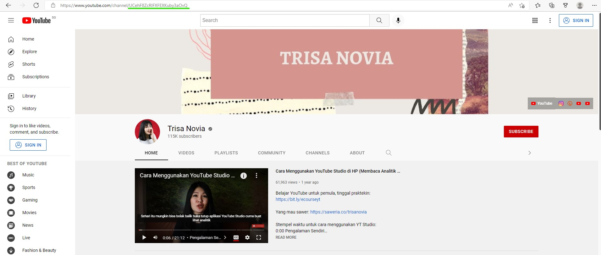
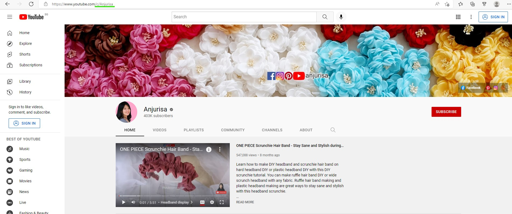
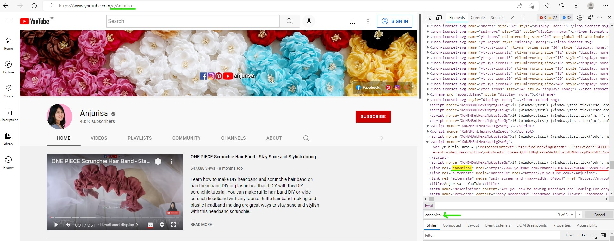

# JTubeSpeech YouTube Audio and Transcript Scraper Pipeline
A forked repository that scrapes the audio and transcripts from youtube videos based on youtube's channel ID using the `youtube-dl` library. This scraping pipeline have slight differences from the main repository of JTubeSpeech. Please refer to the official [JTubeSpeech](https://github.com/sarulab-speech/jtubespeech) for the original implementation if you are interested.   

In this repository, we focus only on manual transcriptions and ignore the auto-generated ones as they are inaccurate.   

## Introduction
### Tasks in this pipeline
The tasks in this pipeline are as follows:   
1. [Obtain Channel ID from Youtube (Manual Step)](#obtain-channel-id-from-youtube)
2. [Get Video ID from Channel ID](#get-video-id-from-channel-id)
3. [Check Subtitle Exists](#check-subtitle-exists)
4. [Pruning and Batching of Video ID](#pruning-and-batching-of-video-id)
5. [Download Videos and Transcripts](#download-videos-and-transcripts) 
6. [Data Preprocessing](#data-preprocessing)
    
Note that some of the codes here will require the ISO 639-1 language code of the target audio and transcript language that you want to scrape. You can get the ISO 639-1 language code of all the languages [here](https://en.wikipedia.org/wiki/List_of_ISO_639-1_codes).
    
## Project Organization
There will be some folders generated along the way as the codes are executed in this pipeline. The instructions will be shown below in the repository structure on what will be generated as the codes are being executed.   
  
The repository structure will be as shown below:    
```
.
├── batching.py
├── check_subtitle_exists.py
├── data_preprocessing.py
├── download_video.py
├── get_video_id.py
├── docker-compose.yml
├── Dockerfile
├── img
│   └── <all_the_images_for_the_readme>
├── LICENSE
├── README.md
├── requirements.txt
├── channel_id
│   └── id
│       ├── id_1.txt
│       └── id_small_demo.txt
├── scripts
│   ├── batching.sh
│   ├── check_subtitle_exists.sh
│   ├── data_preprocessing.sh
│   ├── download_video.sh
│   └── get_video_id.sh
├── util.py
└── utils_jtubespeech.py
```
   
## Executing the code
### Getting Started - Via Docker
**Preferably, a Linux OS should be used**   
1. Ensure that docker is installed in your computer   
2. Go to [Docker Hub](https://hub.docker.com/). Create/login to your account   
3. Open the terminal, execute the following command to pull the base image of this Dockerfile. You may be required to login to your Docker Hub account again from the terminal   
```shell
docker pull python:3.8.13-slim-buster
```
4. Clone this repository  
```shell
git clone https://github.com/nicholasneo78/jtubespeech
```
5. Open the terminal and go to the root directory of this repository  
6. Build the Dockerfile that is created in the repository using the docker-compose.yml file
```shell
docker-compose up --build -d
```
7. After building the docker image, check if the image is successfully built, by typing the following command
```shell
docker images
```
You should see the image `jtubespeech` with the tag `latest` in the list of docker images   

### Entering the docker container
To enter into the docker container with the build dependencies, execute the command
```shell
docker-compose run local bash
```
The codes are then ready to be executed inside the docker image, more information about executing each code will be discussed below.   

## Obtain Channel ID from YouTube
This is the **only** manual step needed by the users to retrieve the [YouTube](https://youtube.com) Channel ID. Users are to decide the language of the audio that they want to scrape and proceed to source for the Channel ID of that language domain. The subsequent tasks in the pipeline will be automated with scripts.    

#### How to do it?
Go to YouTube, search your query and go to the video's channel home page. Look out for the url at the top of the webpage, for example:   
  
   
  
The Channel ID in this case will be the one underlined in green, which is `UCehF8ZcRIFXFEXKuby3aOvQ`. Create a text file with the command shown below, copy the Channel ID and paste it in that text file.     
```shell
# inside docker container
cd /jtubespeech/channel_id
mkdir <YOUR_LANGUAGE_ID>  # if it is indonesian, then can skip it since there is already an example .txt file containing the channel id of the indonesian language domain
cd <YOUR_LANGUAGE_ID>
vi <YOUR_TEXT_FILENAME_CONTAINING_YOUR_CHANNEL_ID>.txt # proceed to paste the channel ID in the text file
```
   
There will be an example text file with some channel ID in this repository, at `./jtubespeech/channel_id/id/id_1.txt` (indonesian language domain channels).   
    
#### Note
There may be instances where the Channel ID uses personalized links as shown below.   
  
   
   
As such, an extra step of inspecting the web element is required. You can do so by inspecting the web element, then search for the keyword `canonical`. There will be a few search results, search for the one with the tag `<link rel="canonical" href= ...`, the Channel ID will appear on this line. An example is as shown below:   
   
    
  
You can then copy the Channel ID from the web elements and proceed to add it into the text file.   
    
## Get Video ID from Channel ID   
To read in the Channel ID text file that has all the target channel IDs, and output all the Video IDs of the channels into another text file.   
   
#### Arguments - `get_video_id.py`
`channel_id`: (str) the input channel .txt filepath with all the target Channel IDs   
`video_id`: (str) the output video .txt filepath with all the Video IDs in the channel   
`is_limit`: [optional] (bool) to check if there is a limit to the scrape per channel   
`limit`: [optional] (int) scrape limit per channel of videoid   
`sleep`: [optional] (int) how many seconds to sleep between API calls to youtube, in order to prevent getting blocked   
   
#### Return
None  

#### Before Executing the code
Check your inputs of the bash script `/jtubespeech/scripts/get_video_id.sh`. A template of the script is as show below  
```shell
#!/bin/bash

CHANNEL_ID_TEXT_FILEPATH="<YOUR_CHANNEL_ID_TEXT_FILEPATH>"
VIDEO_ID_TEXT_FILEPATH="<YOUR_VIDEO_ID_TEXT_FILEPATH>"

python3 ../get_video_id.py \
    --channel_id "../${CHANNEL_ID_TEXT_FILEPATH}" \
    --video_id "../${VIDEO_ID_TEXT_FILEPATH}"
```

#### Executing the code
To execute the code, go to this repository and enter into the docker container (refer above for the command). Inside the docker container, execute the following command:   
```shell
cd /jtubespeech/scripts
chmod 777 get_video_id.sh
./get_video_id.sh
```
   
The bash script `/jtubespeech/scripts/get_video_id.sh` has example inputs to illustrate the example above.   

## Check Subtitle Exists
To check whether the videos have the targeted language subtitles or not. The availability of manual and auto-generated subtitles of the videos will be made known when the script is executed.   
   
#### Arguments - `check_subtitle_exists.py`  
`language`: (str) the targeted language code (ISO 639-1) (eg. ja, en, ...)  
`video_id_list`: (str) filename of video ID text file   
`main_outdir`: (str) main output directory    
`sub_outdir`: (str) sub output directory   
`sub_sub_outdir`: (str) sub sub output directory   
`csv_filepath`: (str) filepath of the final csv file   
`checkpoint`: [optional] (str) filename of list checkpoint (for restart retrieving)   
   
#### Return
The filepath of the final csv file
   
#### Before Executing the code
Check your inputs of the bash script `/jtubespeech/scripts/check_subtitle_exists.sh`. A template of the script is as show below  
```shell
#!/bin/bash

LANGUAGE="<YOUR_LANGUAGE_ID>"
VIDEO_ID_LIST="<YOUR_VIDEO_ID_TEXT_FILEPATH>"
MAIN_DIR="video_id_with_sub" # can standardize with this directory name
SUB_SUB_DIR="<YOUR_VIDEO_ID_TEXT_FILENAME>" # can standardize with this directory name

python3 ../check_subtitle_exists.py \
    --language ${LANGUAGE} \
    --video_id_list "../${VIDEO_ID_LIST}" \
    --main_outdir "../${MAIN_DIR}/" \
    --sub_outdir "../${MAIN_DIR}/${LANGUAGE}/" \
    --sub_sub_outdir "../${MAIN_DIR}/${LANGUAGE}/${SUB_SUB_DIR}/" \
    --csv_filepath "../${MAIN_DIR}/${LANGUAGE}/${SUB_SUB_DIR}/${SUB_SUB_DIR}.csv"
```   
   
#### Executing the code
To execute the code, go to this repository and enter into the docker container (refer above for the command). Inside the docker container, execute the following command:   
```shell
cd /jtubespeech/scripts
chmod 777 check_subtitle_exists.sh
./check_subtitle_exists.sh
```
   
The bash script `/jtubespeech/scripts/check_subtitle_exists.sh` has example inputs to illustrate the example above.    
   
## Pruning and Batching of Video ID
To prune away those video IDs that does not have manual subtitles, then split the remaining video IDs into multiple csv files. The number of video ID entries per csv is controllable. The splitted csv files will be in the same directory as the csv file that is yet to be splitted. Doing so allows the ability to download the audio and transcripts in batches (shown in the next section). Hence, it reduces the risk of long execution time to download the audio and transcripts all at once.   
   
#### Arguments - `batching.py`  
`language`: (str) the targeted language code (ISO 639-1) (eg. ja, en, ...)  
`raw_csv`: (str) filepath of the raw csv that is yet to be splitted  
`entries`: [optional] (int) number of entries per csv file, if not stated, the default will be 50 entries per csv file    
    
#### Return
None  

#### Before Executing the code
Check your inputs of the bash script `/jtubespeech/scripts/batching.sh`. A template of the script is as show below  
```shell
#!/bin/bash

LANGUAGE="<YOUR_LANGUAGE_ID>"
INPUT_CSV_FILEPATH="<THE_FILEPATH_OF_THE_CSV_GENERATED_FROM_THE_PREVIOUS_PHASE>"
ENTRIES_PER_CSV_BATCH=<NUMBER_OF_VIDEO_IDS_PER_CSV_BATCH>

python3 ../batching.py \
    --language ${LANGUAGE} \
    --raw_csv "../${INPUT_CSV_FILEPATH}" \
    --entries ${ENTRIES_PER_CSV_BATCH}
```  
    
#### Executing the code
To execute the code, go to this repository and enter into the docker container (refer above for the command). Inside the docker container, execute the following command:   
```shell
cd /jtubespeech/scripts
chmod 777 batching.sh
./batching.sh
```
   
The bash script `/jtubespeech/scripts/batching.sh` has example inputs to illustrate the example above.    
   
## Download Videos and Transcripts
Reads the batched csv files generated earlier, takes in the Video ID, then downloads the audio and the transcript.   
   
#### Arguments - `download_video.py`  
`language`: (str) the targeted language code (ISO 639-1) (eg. ja, en, ...)  
`sublist`: (str) batched csv file with a list of video IDs with subtitles   
`outdir`: (str) the root directory where the audio and the corresponding transcript are saved   
`keeporg`: [optional] (bool) to keep or not to keep the original audio file, default False  
    
#### Return
The root folder where the audios and transcripts are being saved.   
   
#### Before Executing the code
Check your inputs of the bash script `/jtubespeech/scripts/download_video.sh`. A template of the script is as show below  
```shell
#!/bin/bash

LANGUAGE="<YOUR_LANGUAGE_ID>"
BATCH_CSV_FILE="<FILEPATH_TO_THE_BATCH_CSV>"
OUTPUT_DIR="video" # can fix this output directory

python3 ../download_video.py \
    --language ${LANGUAGE} \
    --sublist ${BATCH_CSV_FILE} \
    --outdir ${OUTPUT_DIR}
```  
   
#### Executing the code
To execute the code, go to this repository and enter into the docker container (refer above for the command). Inside the docker container, execute the following command:   
```shell
cd /jtubespeech/scripts
chmod 777 download_video.sh
./download_video.sh
```
    
The bash script `/jtubespeech/scripts/download_video.sh` has example inputs to illustrate the example above.    
    
## Data Preprocessing
To preprocess the scraped jtubespeech data into a more standardized format. This code splits into 2 parts:
1. Restructure the JTubeSpeech data file directory such that the audio and transcript are placed together    
2. Splitting the audio and transcript into utterance level    
   
#### Arguments - `data_preprocessing.py`  
`root_folder`: (str) the folder where the raw vtt and wav16k folder resides   
`dest_folder_name`: (str) the directory name created to store the restructured data for the preprocessing task    
`file_type_vtt`: (str) file type of the folder name needed to extract the transcript    
`file_type_wav`: (str) file type of the folder name needed to extract the raw audio  
`main_data_folder`: (str) main data folder with all the raw data that is to be processed   
`preprocessed_data_folder`: (str) new directory name for the preprocessed data     
`audio_format`: (str) the audio format of the exported preprocessed audio    
     
#### Return
None   
    
#### Before Executing the code
Check your inputs of the bash script `/jtubespeech/scripts/data_preprocessing.sh`. A template of the script is as show below  
```shell
#!/bin/bash
ROOT_FOLDER="<THE_FOLDER_WHERE_THE_RAW_VTT_AND_WAV16K_FILES_RESIDE>"
DEST_FOLDER_NAME="<DIRECTORY_NAME_CREATED_TO_STORE_THE_RESTRUCTURED_DATA>"
FILE_TYPE_VTT="vtt"
FILE_TYPE_WAV="wav16k"
MAIN_DATA_FOLDER="${ROOT_FOLDER}/${DEST_FOLDER_NAME}"
PREPROCESSED_DATA_FOLDER="<NEW_DIRECTORY_NAME_FOR_THE_PREPROCESSED_DATA>"
AUDIO_FORMAT="<THE_AUDIO_FORMAT_OF_THE_PREPROCESSED_AUDIO>"

python3 ../data_preprocessing.py \
    --root_folder ${ROOT_FOLDER} \
    --dest_folder_name ${DEST_FOLDER_NAME} \
    --file_type_vtt ${FILE_TYPE_VTT} \
    --file_type_wav ${FILE_TYPE_WAV} \
    --main_data_folder ${MAIN_DATA_FOLDER} \
    --preprocessed_data_folder ${PREPROCESSED_DATA_FOLDER} \
    --audio_format ${AUDIO_FORMAT} 
```  
    
#### Executing the code
To execute the code, go to this repository and enter into the docker container (refer above for the command). Inside the docker container, execute the following command:   
```shell
cd /jtubespeech/scripts
chmod 777 data_preprocessing.sh
./data_preprocessing.sh
```
    
    
## Contributors of the main JTubeSpeech repository
- [Shinnosuke Takamichi](https://sites.google.com/site/shinnosuketakamichi/home) (The University of Tokyo, Japan) [main contributor]
- [Ludwig Kürzinger](https://www.ei.tum.de/mmk/personen/mitarbeiter/ludwig-kuerzinger/) (Technical University of Munich, Germany)
- [Takaaki Saeki](https://takaaki-saeki.github.io/) (The University of Tokyo, Japan)
- [Sayaka Shiota](http://www-isys.sd.tmu.ac.jp/) (Tokyo Metropolitan University, Japan)
- [Shinji Watanabe](https://sites.google.com/view/shinjiwatanabe) (Carnegie Mellon University, USA)

## Useful Link
- [youtube-dl](https://github.com/ytdl-org/youtube-dl)
- [JTubeSpeech Research Paper](https://arxiv.org/abs/2112.09323)
- [Other corpora by main contributor](https://sites.google.com/site/shinnosuketakamichi/publication/corpus)
